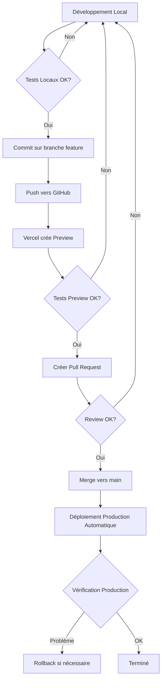

# 🔄 Workflow de Développement avec Environnement de Production

**Date** : Décembre 2025  
**Contexte** : Vous avez basculé vers la production et vous vous demandez comment continuer à développer.

---

## 📊 Situation Actuelle

Vous avez configuré :
- ✅ `.env.local` → Variables pointant vers la **production**
- ✅ **Vercel** → Variables d'environnement configurées pour la **production**
- ✅ **Gadget** → Application déployée en **production**

---

## 🎯 Stratégies de Développement

Vous avez **plusieurs options** pour continuer à développer sans impacter la production :

### Option 1 : Développement Local avec Production (Recommandé pour petits changements)

**Quand l'utiliser** :
- ✅ Modifications frontend uniquement
- ✅ Tests rapides de nouvelles fonctionnalités
- ✅ Débogage de problèmes spécifiques

**Comment ça fonctionne** :
1. Votre `.env.local` pointe vers la production
2. Vous développez localement avec `npm run dev`
3. Vous testez contre l'API de production
4. Une fois validé, vous déployez sur Vercel

**⚠️ Précautions** :
- Ne créez pas de données de test dans la production
- Utilisez un compte de test dédié si possible
- Faites attention aux mutations (création, modification, suppression)

**Workflow** :
```bash
# 1. Développement local
cd stock-easy-app
npm run dev

# 2. Tester localement (connecté à la production)
# → Ouvrez http://localhost:5173

# 3. Une fois validé, commit et push
git add .
git commit -m "feat: nouvelle fonctionnalité"
git push origin feature/ma-feature

# 4. Vercel crée automatiquement un déploiement preview
# → Testez sur l'URL preview de Vercel

# 5. Merge vers main → Déploiement automatique en production
```

---

### Option 2 : Branches Git + Déploiements Preview Vercel (Recommandé)

**Quand l'utiliser** :
- ✅ Développement de nouvelles fonctionnalités
- ✅ Tests avant merge en production
- ✅ Collaboration en équipe

**Comment ça fonctionne** :
1. Vous créez une branche de fonctionnalité
2. Vercel crée automatiquement un **déploiement preview** pour chaque branche
3. Vous testez sur l'URL preview (isolée de la production)
4. Une fois validé, vous mergez vers `main` → déploiement automatique en production

**Avantages** :
- ✅ Isolation complète de la production
- ✅ Tests en conditions réelles (mais sur une URL différente)
- ✅ Pas besoin de changer les variables d'environnement
- ✅ Chaque PR a sa propre URL de preview

**Workflow** :
```bash
# 1. Créer une branche de fonctionnalité
git checkout -b feature/ma-nouvelle-fonctionnalite

# 2. Développer localement
cd stock-easy-app
npm run dev
# → Modifier le code...

# 3. Commit et push
git add .
git commit -m "feat: ma nouvelle fonctionnalité"
git push origin feature/ma-nouvelle-fonctionnalite

# 4. Vercel crée automatiquement un déploiement preview
# → URL : https://stock-easy-app-git-feature-ma-nouvelle-fonctionnalite-xxx.vercel.app
# → Cette URL utilise les mêmes variables d'environnement que la production

# 5. Tester sur l'URL preview
# → Ouvrez l'URL preview dans votre navigateur
# → Testez toutes les fonctionnalités

# 6. Créer une Pull Request sur GitHub
# → Vercel ajoute un commentaire avec l'URL preview

# 7. Une fois validé, merge vers main
# → Déploiement automatique en production
```

**Configuration Vercel** :
- Les variables d'environnement sont partagées entre Production, Preview et Development
- Vous pouvez aussi créer des variables spécifiques aux previews si nécessaire

---

### Option 3 : Environnement de Développement Gadget (Pour changements backend)

**Quand l'utiliser** :
- ✅ Modifications dans le code Gadget (backend Shopify)
- ✅ Tests de nouvelles actions/API
- ✅ Tests de webhooks
- ✅ Développement de fonctionnalités Shopify

**Comment ça fonctionne** :
1. Vous basculez temporairement vers l'environnement de développement Gadget
2. Vous modifiez votre `.env.local` pour pointer vers le dev
3. Vous testez localement
4. Une fois validé, vous déployez en production Gadget
5. Vous remettez votre `.env.local` vers la production

**⚠️ Important** :
- L'environnement de développement Gadget est séparé de la production
- Les données de test ne polluent pas la production
- Vous devez basculer manuellement entre dev et prod

**Workflow** :
```bash
# 1. Basculer vers l'environnement de développement Gadget
cd stockeasy-app-gadget
yarn shopify:config:use:development

# 2. Modifier votre .env.local (frontend)
cd ../stock-easy-app
# Dans .env.local, changez temporairement :
# VITE_GADGET_API_URL=https://stockeasy-app--development.gadget.app

# 3. Développer et tester localement
npm run dev
# → Testez vos changements backend

# 4. Déployer les changements Gadget en développement
cd ../stockeasy-app-gadget
yarn shopify:deploy:development

# 5. Une fois validé, déployer en production Gadget
yarn shopify:config:use:production
yarn shopify:deploy:production

# 6. Remettre le .env.local vers la production
cd ../stock-easy-app
# Dans .env.local, remettez :
# VITE_GADGET_API_URL=https://stockeasy-app.gadget.app
```

---

### Option 4 : Environnement de Staging Dédié (Pour projets avancés)

**Quand l'utiliser** :
- ✅ Projets avec plusieurs développeurs
- ✅ Tests d'intégration complets
- ✅ Validation avant déploiement production

**Comment ça fonctionne** :
1. Créez un projet Vercel séparé pour le staging
2. Créez un environnement Gadget séparé (ou utilisez le dev)
3. Configurez des variables d'environnement spécifiques au staging
4. Déployez automatiquement sur staging à chaque push sur `develop`
5. Déployez en production uniquement depuis `main`

**Configuration** :
- **Branche `develop`** → Déploiement automatique sur staging
- **Branche `main`** → Déploiement automatique sur production
- Variables d'environnement séparées pour chaque environnement

---

## 🔧 Configuration Recommandée

### Pour le Développement Quotidien

**Stratégie hybride recommandée** :

1. **Frontend (React/Vite)** :
   - Développement local avec `.env.local` pointant vers la production
   - Utilisation de branches Git + déploiements preview Vercel
   - Tests sur les URLs preview avant merge

2. **Backend Gadget** :
   - Développement dans l'environnement de développement Gadget
   - Tests locaux avec `.env.local` pointant vers dev
   - Déploiement en production Gadget une fois validé

3. **Variables d'environnement** :
   - `.env.local` : Production (pour développement frontend)
   - Vercel : Production (pour tous les déploiements)
   - Gadget Dev : Pour tests backend isolés

---

## 📋 Checklist de Développement

### Avant de commencer à développer

- [ ] Vérifier que vous êtes sur la bonne branche
- [ ] Vérifier que `.env.local` est configuré correctement
- [ ] Vérifier que les dépendances sont à jour (`npm install`)

### Pendant le développement

- [ ] Tester localement avec `npm run dev`
- [ ] Vérifier que les changements fonctionnent comme attendu
- [ ] Faire attention à ne pas créer de données de test en production

### Avant de déployer

- [ ] Commit et push sur une branche de fonctionnalité
- [ ] Tester sur l'URL preview Vercel
- [ ] Vérifier que tous les tests passent
- [ ] Créer une Pull Request si nécessaire
- [ ] Faire une review du code

### Après le déploiement

- [ ] Vérifier que le déploiement en production fonctionne
- [ ] Monitorer les logs Vercel pour détecter les erreurs
- [ ] Vérifier que les utilisateurs peuvent utiliser la nouvelle fonctionnalité

---

## 🚨 Points d'Attention

### ⚠️ Ne jamais faire ça en production

- ❌ Créer des données de test
- ❌ Modifier directement les données de production sans backup
- ❌ Déployer du code non testé directement sur `main`
- ❌ Utiliser des credentials de production dans le code

### ✅ Bonnes pratiques

- ✅ Toujours tester sur preview avant de merger
- ✅ Utiliser des branches de fonctionnalité
- ✅ Faire des commits atomiques et descriptifs
- ✅ Utiliser l'environnement de développement Gadget pour les tests backend
- ✅ Monitorer les logs après chaque déploiement

---

## 🔄 Workflow Complet Recommandé



---

## 📚 Ressources

- [Documentation Vercel - Preview Deployments](https://vercel.com/docs/deployments/preview-deployments)
- [Documentation Gadget - Environments](https://docs.gadget.dev/guides/environments)
- [Guide de Déploiement](./DEPLOYMENT_GUIDE.md)
- [Guide d'Installation Premier Marchand](./INSTALLATION_PREMIER_MARCHAND.md)

---

## ❓ Questions Fréquentes

### Q: Puis-je développer directement sur main ?

**R:** Non, c'est déconseillé. Utilisez toujours des branches de fonctionnalité pour isoler vos changements.

### Q: Les déploiements preview utilisent-ils les mêmes données que la production ?

**R:** Oui, par défaut. Les déploiements preview utilisent les mêmes variables d'environnement que la production, donc ils se connectent aux mêmes services (Supabase, Gadget). Si vous voulez isoler complètement, créez un environnement de staging séparé.

### Q: Comment tester des changements backend sans impacter la production ?

**R:** Utilisez l'environnement de développement Gadget. Changez temporairement votre `.env.local` pour pointer vers `https://stockeasy-app--development.gadget.app`, testez, puis remettez vers la production.

### Q: Que se passe-t-il si je casse quelque chose en production ?

**R:** Vercel garde un historique des déploiements. Vous pouvez faire un rollback en allant dans votre projet Vercel → Deployments → Sélectionner un déploiement précédent → "Promote to Production".

---

**Dernière mise à jour** : Décembre 2025
